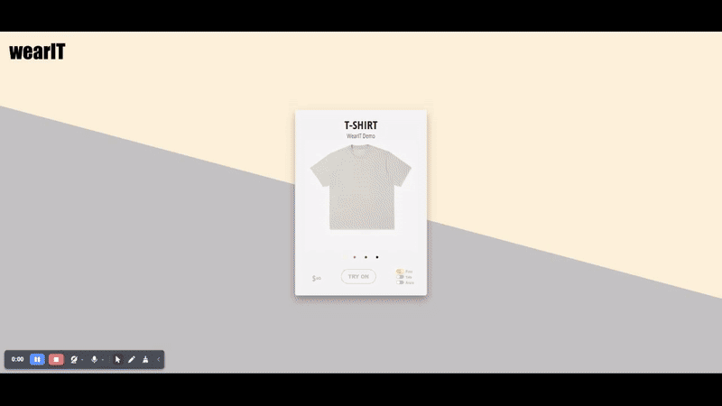

# wearIT - Virtual Try-On Application

## Overview

**wearIT** is a virtual try-on application that overlays clothing (such as t-shirts) on live video streams or pre-recorded videos using computer vision and machine learning models. It supports multiple detection techniques—including YOLO, MediaPipe, and ArUco markers—providing flexibility and accuracy in detecting body landmarks and mapping clothing accordingly. This application offers an interactive and practical way to visualize clothing on oneself virtually.

---

## Demo

Watch the application in action:



*The demo showcases how the website functions, letting users try on different t-shirt designs using either a live camera feed or pre-recorded videos.*

---

## Features

- **Virtual Try-On:**  
  Allows users to virtually try on t-shirts over a live video feed or pre-recorded video.
- **Detection Methods:**
  - **YOLO:** Advanced pose detection using a YOLO model fine-tuned on the COCO-pose dataset.
  - **MediaPipe:** Lightweight, real-time pose detection using Google's MediaPipe.
  - **ArUco:** Marker-based detection for high accuracy in controlled environments.
- **Customizable Clothing:**  
  Easily swap between different shirt designs.
- **Compatibility:**  
  Works with both live camera feeds and pre-recorded videos.

---

## Prerequisites

Before running **wearIT**, ensure you have the conda environment specified for this project by using the `conda_env.yaml` file.

---

## Installation

1. **Download the Repository:**  
   Clone or download all the files for the application.

2. **Install the Environment:**  
   Create and activate the conda environment:
   ```bash
   conda env create -f conda_env.yaml
   conda activate <environment_name>
   ```
   *(Replace `<environment_name>` with the name specified in `conda_env.yaml`.)*

---

## Usage

1. **Start the Flask Server:**  
   In the project directory, run:
   ```bash
   python app.py
   ```
   This starts the backend/frontend Flask server responsible for video processing and API endpoints.

2. **Open the Application:**  
   Open your web browser and navigate to:
   ```
   http://127.0.0.1:5000/
   ```

3. **Interact with the Application:**  
   Choose a detection method and shirt design, then view the live or pre-recorded virtual try-on.

---

## File Structure

- **`index.html`**  
  The main HTML file for the application.  
  *(Special thanks to Fabio Ottaviani for his contribution on CodePen.)*

- **`script.js`**  
  Frontend JavaScript handling user interactions.

- **`style.css`**  
  CSS for frontend styling.

- **`config.py`**  
  Backend configuration including:
  - Paths for models, videos, and shirt images.
  - Keypoints for mapping t-shirt overlays. Adjust these coordinates as needed.

- **`video_processor.py`**  
  Processes video frames by:
  - Detecting body landmarks using YOLO, MediaPipe, or ArUco.
  - Mapping and overlaying t-shirts using homography transformation.

- **`app.py`**  
  The Flask application that:
  - Defines routes for the main page and video feed.
  - Integrates video processing logic.

- **`demo.py`**  
  A demo script that showcases model usage on images.  
  *(For best results, run the Flask server as described in the Usage section.)*

- **`Research/`**  
  Contains documentation and iterations of work that led to the final application, including experiments and model findings.

---

## How It Works

1. **Body Landmark Detection:**  
   Utilizes YOLO, MediaPipe, or ArUco to identify key points (e.g., shoulders, hips).

2. **Homography Transformation:**  
   Maps predefined t-shirt points to the detected body landmarks.

3. **Image Warping:**  
   Warps the t-shirt image to align with the detected body points.

4. **Overlay:**  
   Merges the warped t-shirt image with the video frame to create a virtual try-on effect.

---

## Project History

*This repository is being uploaded as a complete package with all files included. The project has been developed from scratch and represents a single, consolidated upload of the complete work from 2024.*

---

## Contributors

- Ghasif Syed

---

## Credits

- **COCO Dataset:** [COCO Dataset](https://cocodataset.org/#home)
- **Ultralytics YOLO:** [Ultralytics YOLO](https://github.com/ultralytics/yolov5)
- **MediaPipe:** [MediaPipe](https://mediapipe.dev/)
- **OpenCV:** [OpenCV](https://opencv.org/)
- **Frontend Inspiration:** [CodePen by Fabio Ottaviani](https://codepen.io/supah/pen/mPbLqp)
